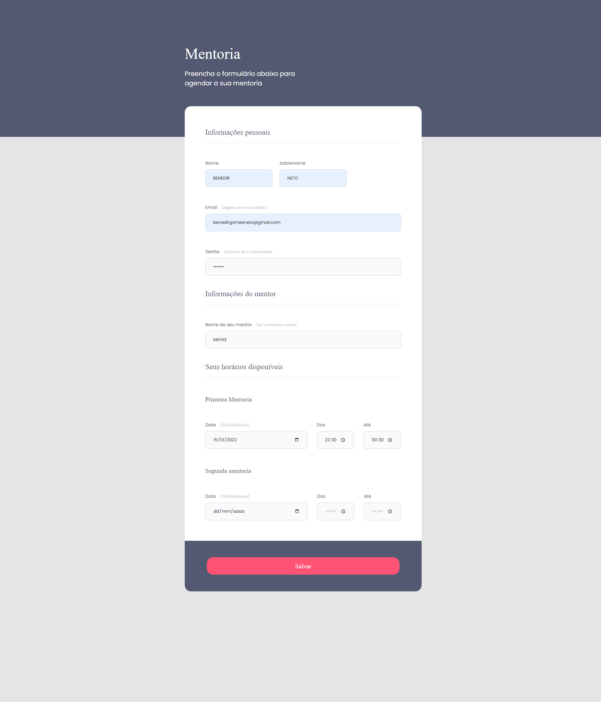

# Criando Formulario

>Desafio Turma Explorer 06

Criando formulario com html e css. Layout disponivel pelo figma.

🔗[Clique aqui para acessar o Formulario](https://benedirgomesneto.github.io/Formulario-Mentoria/)

🔗[Clique aqui para acessar o figma](https://www.figma.com/file/Nws1KWB7DyXBw8L6wXb9mp/Stage-03---Formul%C3%A1rio-intermedi%C3%A1rio?node-id=3%3A4)

## 🛠Tecnologias

- HTML
- CSS
- Git e Github
- figma

## Desafio

Desafio proposto após o fim da primeira aula do nivel 3 do curso explorer. O objetivo era criar uma pagina de formulario

## 💛Contato

benedirgomesneto@gmail.com
